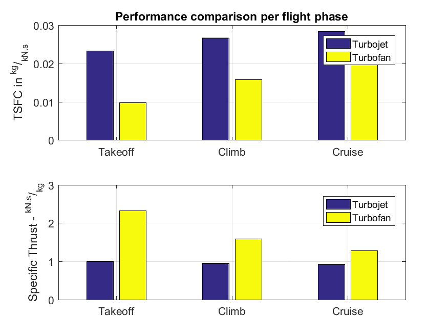

# Aircraft Engine Modeling

This project models the steady-state behavior of three different types of aircraft engines: [turbofan](https://en.wikipedia.org/wiki/Turbofan), [turbojet](https://en.wikipedia.org/wiki/Turbojet) and [ramjet](https://en.wikipedia.org/wiki/Ramjet). It allows the study of their performance at different operating conditions.

### Params files

The files named *turbofan.m*, *turbojet.m* and *ramjet.m* contain functions which return the parameters of theses engines (there are geometric and physical parameters). 

### engine.m

This implements a thermodynamic model for three different aeronautical engines: turbofan, turbojet and ramjet. It models the *steady-state* behavior of the engine.

### atmosferaISA.m

This is a function which implements the [ISA atmosphere model](https://en.wikipedia.org/wiki/International_Standard_Atmosphere). It returns the standard air density, temperature and pressure for a given altitude.

### Scripts

The following files are Matlab scripts which can be run independently:

**simulate_engine.m**: This calls the *engine* function to simulate the steady-state of any of the engine types. Upon running this script, user is prompted to choose a specific engine type and operating conditions (aircraft mach number and flight altitude). It prints the result of simulation as below.

```Matlab
     T02: 606.6200
     P02: 245.2238
     T03: 1.6812e+03
     P03: 7.3567e+03
     T04: 1600
     P04: 7.3567e+03
     TET: 0
     PET: 0
     T05: 525.4201
     P05: 29.2655
     T06: 525.4201
     P06: 29.2655
     T08: 606.6200
     P08: 245.2238
     u_s: 591.0395
    u_sf: 0
       f: -0.0021
    f_pq: 0
       u: 887.1293
    T_ma: -0.2973
    TSFC: 0.0070
```

**performance_per_flight_phase.m**: This displays a graph with a performance comparison between turbojet and turbofan engines for different flight phases (takeoff, climb and cruise). The performance is measured in terms of [TSFC](https://en.wikipedia.org/wiki/Thrust-specific_fuel_consumption) and [specific thrust](https://en.wikipedia.org/wiki/Specific_impulse) (one is the inverse of the other).


