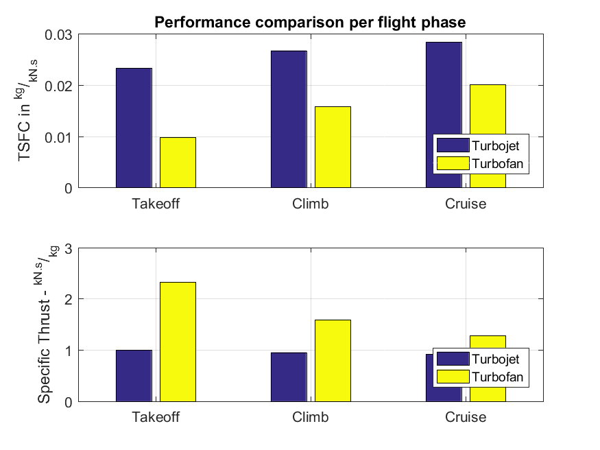

# Aircraft Engine Modeling

This project models the steady-state behavior of three different types of aircraft engines: [turbofan](https://en.wikipedia.org/wiki/Turbofan), [turbojet](https://en.wikipedia.org/wiki/Turbojet) and [ramjet](https://en.wikipedia.org/wiki/Ramjet). It allows the study of their performance at different operating conditions.

### Params files

The files named *turbofan.m*, *turbojet.m* and *ramjet.m* contain functions which return the parameters of theses engines (there are geometric and physical parameters). 

### engine.m

This implements a thermodynamic model for three different aeronautical engines: turbofan, turbojet and ramjet. It models the *steady-state* behavior of the engine.

### Scripts

The following files are Matlab scripts which can be run independently:

**performance_per_flight_phase.m**: This displays a graph with a performance comparison between turbojet and turbofan engines for different flight phases (takeoff, climb and cruise). The performance is measured in terms of [TSFC](https://en.wikipedia.org/wiki/Thrust-specific_fuel_consumption) and [specific thrust](https://en.wikipedia.org/wiki/Specific_impulse) (one is the inverse of the other).

